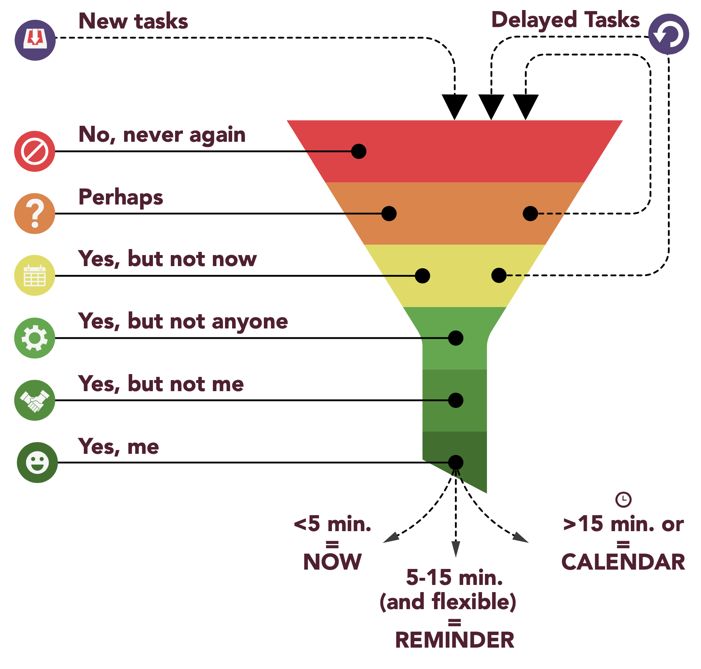

When you think about everything you need to do today, how do you determine which tasks are **most valuable**?  
How do you know that you're spending your time wisely?

The technique I'm using the prioritize my tasks is the .

The idea of the funnel is that you take tasks in, work them through it and in the end only that which is most valuable comes out.

Read on to understand how to change from being ~~busy~~ to being **valuable**.

 

## 🆕 New tasks
It all starts with a task that you want to work through the funnel.

## ❌ No, never again
These are so-called **zero-value activities**, which include wasting time, negative self-talk and destructive behaviors.  
They are the worst investment of your time and you should eliminate them.

Questions you can ask yourself:
* *"Is this task something you never ever want to do or see again?"*

## 🤷🏻‍♂️ Perhaps
These are tasks that have **no clear value** or decision attached to them. That's typically because you either lack information or it's not something you normally do.  

You don't want to put the task on your calendar, because what's on your calendar is a commitment.  

Still, it's important to write these tasks/ideas down, because they tend to occur repeatedly in our minds and slow down our productivity, unless we do something about them, i.e. get them out of our head.

This list should be reviewed on a regular basis (make a calendar entry), and run through the funnel again.

## 👉🏼 Yes, but not now
Although this task/idea has **some value**, it's extremely low and there's no value in doing them anytime soon if there's no deadline for months/years into the future. 

In this case, use **positive procrastination**. 

Positive procrastination, as opposed to negative procrastination (avoiding something), is a positive thing to do, especially if something has low value.

Review these tasks/ideas regularly by e.g. creating a future reminder.

Questions you can ask yourself:
* *”When’s the latest that I have to start thinking about this?"*

## 💻📱 Yes, but not anyone
Those are tasks/ideas that have a certain value, but shouldn’t be done by anyone but rather **automated**.  
A small investment upfront can save time in the future.  

## 🤝 Yes, but not me
Think about **delegation** (providing clear instructions and expectations plus following up on results) rather than abdication (telling someone to do something that you hope turns out ok).  
Not every task should be delegated; always consider its value. 

Questions you can ask yourself:
* *”Would it be more productive if someone else performed this task instead of me?"*
* *”Would it be more productive if I trained someone else to properly perform this task instead of me?"*
* *”Would it be more productive if I hired the right person to perform this task instead of me?"*  

## 🙋🏽‍♂️ Yes, me
Once you arrive at this stage, it means that the task has passed through the entire filtration system and is actually the **MVA** (**most valuable activity**), which you should do either now or put it on your calendar.  

These activities provide you with the **highest value per time spent**; they should be prioritized over other activities.

If the task ...

#### ⌚️ Takes < 5 minutes
You should *do it now* regardless of the value. This is more efficient than scheduling it.

#### 📑 Takes 5-15 minutes and has no deadline
You should *create a task/reminder* with a specific date and time.

#### 🗓 Takes > 15 minutes or has a fixed deadline
You should *schedule a calendar event* and then do it. The more valuable the task, the sooner it should be done.

 