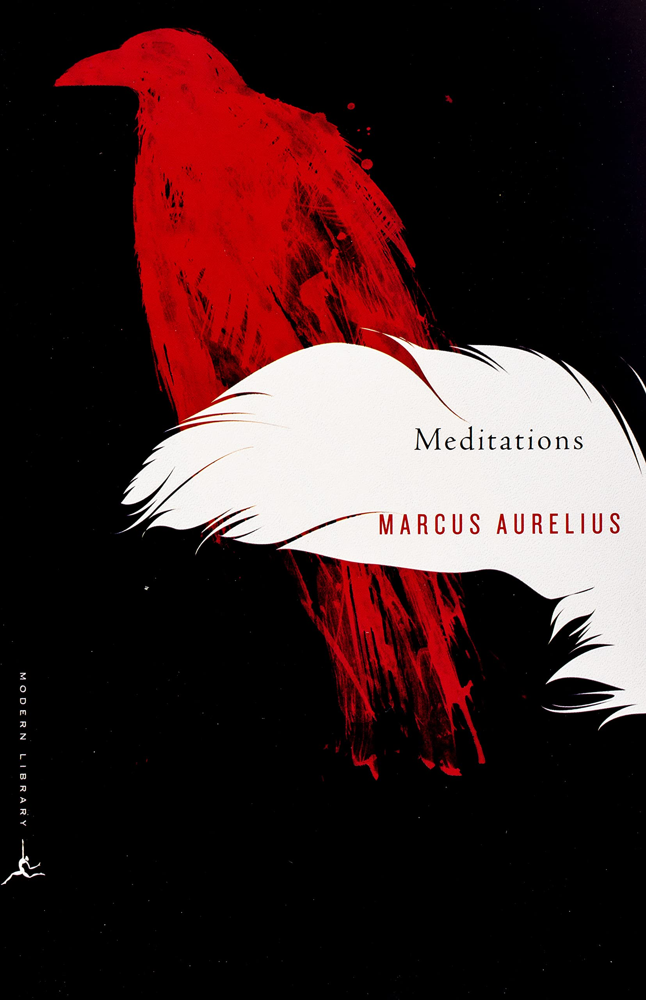

Marcus Aurelius was the most powerful and important man in the world and a great Stoic philosopher. 

He was emperor of Rome for almost two decades starting in the year 161 A.D.

## Be a parent to your 'inner teenager' to live a good disciplined life

Even an emperor like Marcus had a part of himself that wanted to be like a teenager: lazy, undisciplined and lying in bed all day. He spent time **rationally explaining** to himself why certain actions would be bad for him in the long term. Just like a parent explaining to their child why they can’t eat ice cream every day.

For example, at one point he’s talking about what to do if you have trouble getting out of bed in the morning. Then another voice interrupts and whines "But it’s nicer here" and the first voice responds:

> "So you were born to feel nice? Instead of doing things and experiencing them? Don’t you see the plants, the birds, the ants and spiders and bees going about their individual tasks, putting the world in order, as best they can?"

This is a pattern that repeats over and over again in the book, with Marcus using rational thinking to resist his base-level impulses.

## Remember death to stop worrying about what people think

> "You could leave life right now. Let that determine what you say and think."

Marcus often reminded himself that he would soon be dead and anybody who ever knew him would also be dead. This gave him increased emotional stability and less desire for everybody’s approval.

## Choose always to interpret what happens to you as beneficial in some way

> "Choose not to be harmed—and you won’t feel harmed.  
> Don’t feel harmed—and you haven’t been."

When something happens to you, you always have the power to interpret it as harmful or harmless. 

This is similar to what Viktor Frankl wrote about his experiences in the World War II concentration camps, when he said:

> “Everything can be taken from a man but one thing: the last of the human freedoms—to choose one’s attitude in any given set of circumstances, to choose one’s way.”  
> *- Viktor Frankl*

## Believe everything happens for a higher reason to withstand life’s catastrophes

Marcus believed in Providence, which means some higher power is always providing us protection and care. He believed there is an intelligent order to the universe called [Logos](https://www.christianity.com/wiki/christian-terms/logos-in-the-bible-definition-and-significance.html) (an individual person’s ability to think logically), so there must be a reason even for bad events. Although we may not see the reason, we should accept what happens just like swallowing bad-tasting medicine from the doctor.

This way of thinking also helps you accept everything that happens and flow with it, rather than resisting. This is a big part of Stoic philosophy. In the introduction of this book, Gregory Hays wrote a great analogy. He said if a dog is attached by a leash to a moving wagon, then it can either choose to run *with* the wagon or to resist it and be painfully dragged behind it. When people resist things that happen to them, they only make life feel worse for themselves.

## Accept that other people cannot help being imperfect

People *never* do wrong on purpose, they always believe they are doing right.

> "When faced with people’s bad behavior, turn around and ask when you have acted like that. When you saw money as a good, or pleasure, or social position. Your anger will subside as soon as you recognize that they acted under compulsion (what else could they do?)."

People will always resist being called bad, so you must show them with compassion the error of their ways.

## Embrace obstacles to grow your inner fire

Marcus believed humans do not thrive when life is too easy. He saw that challenges are good for the human soul.

He said humans are designed to "turn our obstacles into fuel." Imagine that each new challenge you face is another log you throw on your inner fire, making you burn brighter.  
Marcus saw that any time he faced some external obstacle that at first looked impossible, he was always able to find some way around it to achieve what he really want to do.

> "Because we can accommodate and adapt. The mind adapts and converts to its own purposes the obstacle to our acting. The impediment to action advances action. **What stands in the way becomes the way.**"

> "So remember this principle when something threatens to cause you pain: the thing itself was no misfortune at all; to endure it and prevail is great good fortune."

Marcus says if something is endurable, then stop complaining and endure it. If the obstacle is not endurable (think e.g. a terminal illness) well then you don’t have time to worry about it anyway.

## Describe the raw materials of everything to see life with fresh eyes

Marcus Aurelius was constantly surrounded by the excesses of his society. Endless gold, purple robes, generous feasts and puffed up ceremonies. Most people could easily get over-impressed and lost inside this parallel universe. To help himself stay grounded, Marcus love describing things around him in a raw and crude way.

> "Like seeing roasted meat and other dishes in front of you and suddenly realizing: This is a dead fish. A dead bird. A dead pig. Or that this noble vintage is grape juice, and the purple robes are sheep wool dyed with shellfish blood. Or making love—something rubbing against your penis, a brief seizure and a little cloudy liquid. Perceptions like that—latching onto things and piercing through them, so we see what they really are. That’s what we need to do all the time [...] to lay them bare and see how pointless they are, to strip away the legend that encrusts them."

## Think less about past and future because your life only happens in the present

Marcus recognized that all we have is the **present**. The past already happened, the future has not yet happened. So the past and future only exist inside of our minds. But our whole life is lived in the present, moment-by-moment.

Plus, when all your energy and attention is being wasted by thinking about the past or future, then you have no focus left to put into the present. And your actions can only ever occur in the present moment. You can’t change the past. You can’t do anything about what might or might not happen in the future. Only your actions right now are within your control. 

And a big part of Stoic philosophy is only focusing on the things we can control, not on things we can’t control.

> "Forget everything else. Keep hold of this alone and remember it: Each of us lives only now, this brief instant. The rest has been lived already, or is impossible to see."

> "The present is all that they can give up, since that is all you have, and what you do not have, you cannot lose."

## References
* [Meditations by Marcus Aurelius](https://www.goodreads.com/book/show/30659.Meditations)
* [Meditations \| Summary](https://growth.me/books/meditations/)